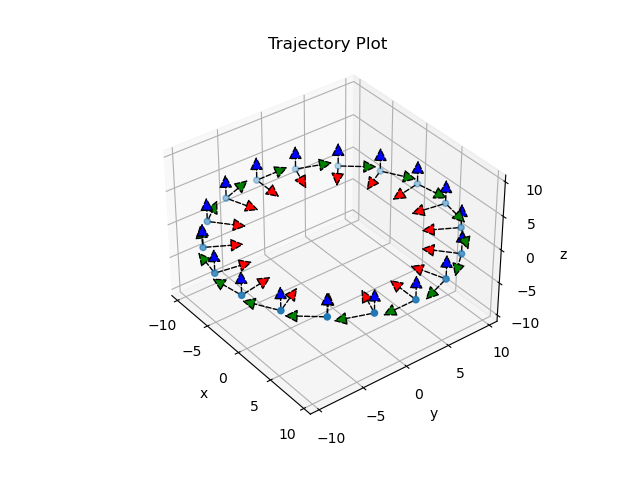

# Trajectory Visualization  
The [viz_trajectory.py](viz_trajectory.py) script is used for visualization of poses from a textfile in the format 'ts _px py pz qx qy qz qw_' where _ts_ is the timestamp in ns and _(px py pz)_ is the translation and _(qx qy qz qw)_ is the rotation in quaternion in the **quaternion last** format.    
The script is used for debugging the output poses saved from the marginalization queue of Basalt. It helps to check if the source and destination frame of the poses is correct i.e. camera to world (z-axis should point forward, i.e. in the direction of motion of the camera).  
  
Running the script:
```
usage: viz_trajectory.py [-h] trajectory_path

Python code for visualization of poses obtained from basalt.

positional arguments:
  trajectory_path  path to .txt file containing poses from basalt

optional arguments:
  -h, --help       show this help message and exit

E.g.
python3 viz_trajectory.py ./trajectories.txt
```  

The [trajectories.txt](trajectories.txt) file has been generated to check the script. The poses are generated such that the camera moves in a cricle in a plane always facing the center. (shown below)  
  

Another demo image of the poses of the hka-outdoors-1 sequence visualized:
  

---

[quiver3d_demo.py](quiver3d_demo.py) is just a demo script for visualizing the arrow object in a matplotib window. [[ref]](https://gist.github.com/WetHat/1d6cd0f7309535311a539b42cccca89c)